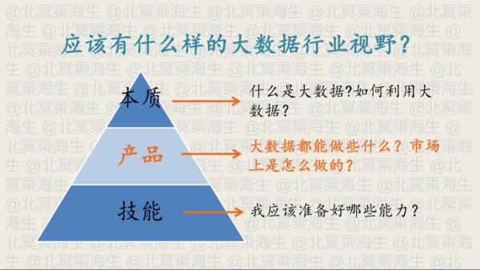
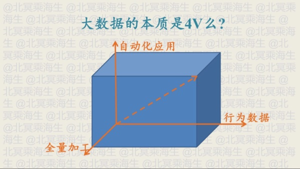
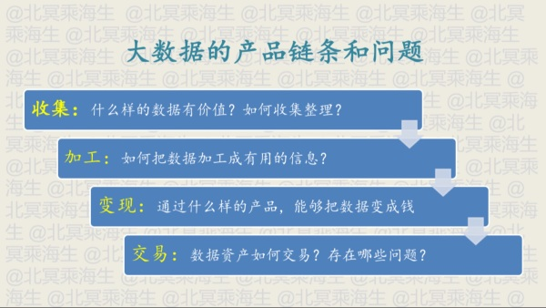
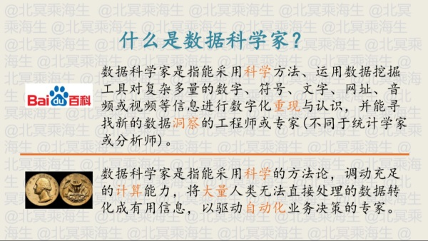
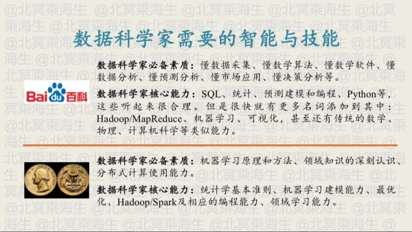
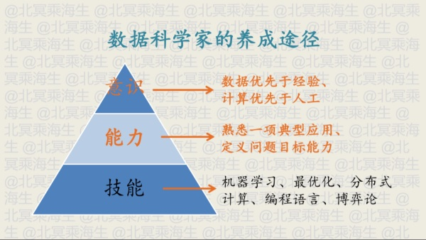
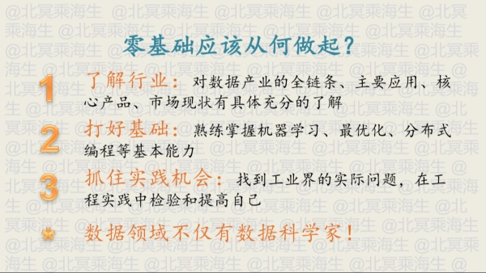
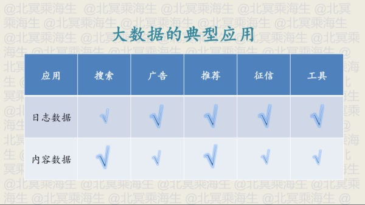
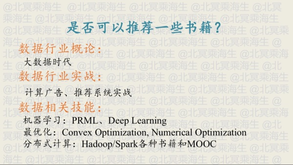

在这个知乎live里听到了一个之前听到过的名词“计算广告”，在我离职前的一次公司分享会上，南京地区大boss张总就对这个概念侃侃而谈，还推荐了这本同名书籍。

而我们组之后做的用户行为数据记录应该也是为了流量变现做准备，我最后的印象是已经接入了google的数据统计接口，就是不知道最后做的怎么样了。

<!--more-->

---

#### 大数据和人工智能的关系

- 数据是基础
- 机器学习是方法
- 产品是目的

#### 大数据行业视野

重点：产品，链接现实与愿景

#### 大数据的本质

- 行为数据 与之对应的是交易数据
  + 交易数据，为了维持业务开展所必须要记录的数据；对通信运营商来说，通话日志、充值日志等
  + 行为数据，通话内容、地理位置、上网内容等
- 全量加工 全部数据都需要使用，而不是通过部分采样就能够完成的任务
- 自动化应用 关键，相对于洞察应用（报表），机器决定而不是人决定，例如计算广告、个人征信系统

#### 大数据的产品链条和问题

收集 -> 加工 -> 变现 -> 交易

收集：不同行业不同的收集方式，传感器自动收集

加工：用户画像，将原始数据转化成业务所需要的数据

变现：已有成熟的互联网解决方案，流量和数据变现

#### 数据科学家 Data Scientists

硅谷里把博士毕业后从事数据行业的人统称，并不特指科学家

并不强调洞察，而是计算，驱动机器计算自动化做决策

必备素质：

1、 机器学习，统计学技能是基础

2、 领域知识

3、 分布式计算

核心能力：

1、 统计学基本准则

2、 机器学习建模能力

3、 模型最优化

4、 大数据工具、编程能力

5、 领域知识学习能力

###### 意识：数据优先于经验、计算优先于人工

能力：熟悉一项应用的全流程，其他的应用就有了一套可以借鉴的问题解决模板；定义问题目标的能力，将现实的问题转化为一套可以通过处理数据来解决的问题

技能：基础能力

#### 从零开始

除了数据科学家，还有数据工程师、数据分析师、产品经理、运营等

数据分析师：与数据科学家对比来说，更依赖于数据洞察

#### 典型应用

日志数据：用户操作相关数据，用户点击、访问

内容数据：用户访问的内容，音频、文本、视频内容

不同应用侧重的数据不同

#### 推荐图书

---
